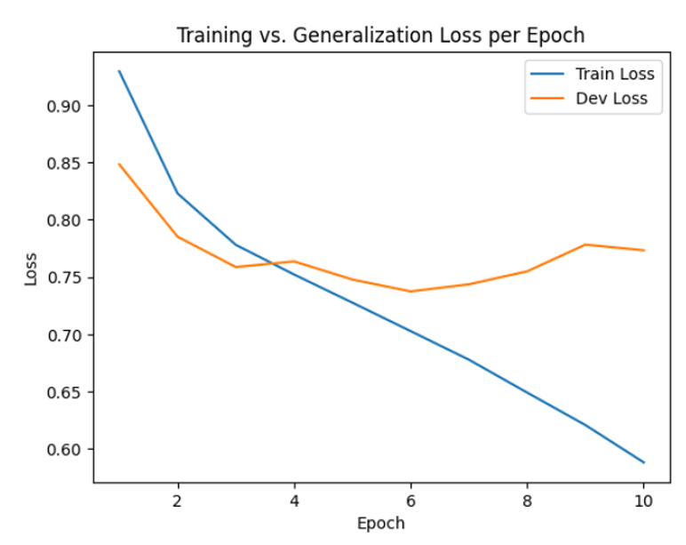
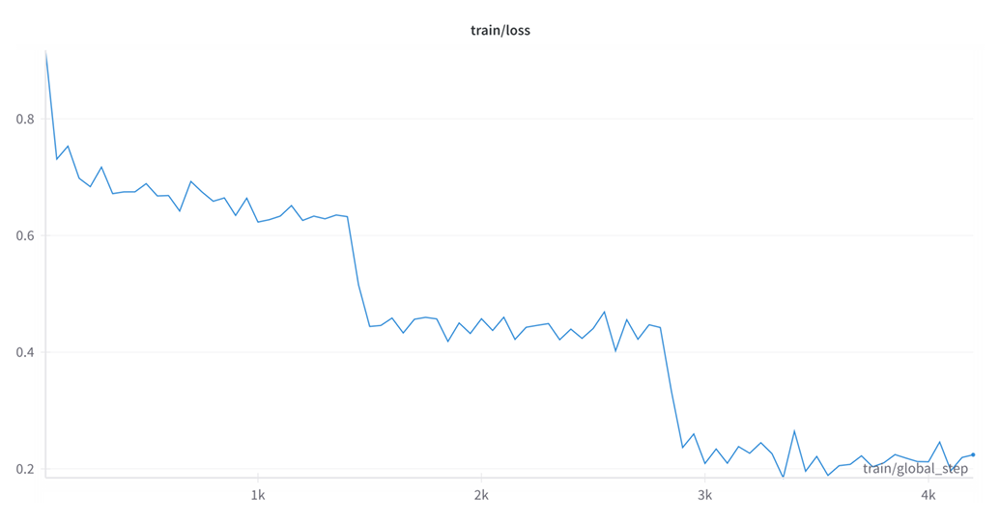

# Twitter Sentiment Classification: Classical ML vs LSTM vs Quantized BERT

End-to-end sentiment classification on the SemEval 2017 Twitter/X dataset, comparing classical machine learning, word embeddings, recurrent neural networks, transformer fine-tuning and few-shot prompting.

The project evaluates multiple approaches for classifying tweets as **positive**, **negative** or **neutral**, with the best full-test model being a fine-tuned and dynamically quantized **BERT** classifier achieving a **0.713 mean macro-F1 score** across three SemEval test sets.

---

## 🚀 Highlights

* Built and compared **TF-IDF SVM**, **MaxEnt**, **GloVe-based models**, **LSTM**, **Quantized BERT** and **Few-Shot FLAN-T5 Prompting**.
* Fine-tuned BERT using Hugging Face Transformers and PyTorch.
* Applied dynamic quantization to improve inference speed while maintaining strong performance.
* Evaluated models across three independent SemEval test sets using macro-F1.
* Performed error analysis using confusion matrices and validation-loss curves.
* Demonstrated the progression from classical NLP techniques to modern transformer architectures.

---

## 🛠️ Technologies Used

* Python
* Scikit-learn
* PyTorch
* Hugging Face Transformers
* GloVe Embeddings
* BERT
* FLAN-T5
* NumPy
* Pandas
* Matplotlib

---

## 📊 Results

| Classifier         | Test 1    | Test 2    | Test 3    | Mean      | Std       |
| ------------------ | --------- | --------- | --------- | --------- | --------- |
| BoW + SVM          | 0.601     | 0.608     | 0.567     | 0.592     | 0.018     |
| Avg-GloVe + SVM    | 0.418     | 0.414     | 0.449     | 0.427     | 0.016     |
| BoW + MaxEnt       | 0.538     | 0.538     | 0.519     | 0.532     | 0.009     |
| Avg-GloVe + MaxEnt | 0.562     | 0.575     | 0.533     | 0.557     | 0.018     |
| LSTM               | 0.586     | 0.592     | 0.546     | 0.575     | 0.020     |
| **Quantized BERT** | **0.721** | **0.714** | **0.704** | **0.713** | **0.007** |
| Few-shot FLAN-T5*  | 0.750     | 0.727     | 0.656     | 0.711     | 0.040     |

* Few-shot prompting was evaluated on stratified subsets for faster experimentation and should not be treated as directly equivalent to the full-test BERT evaluation.

---

## 📈 Training Visualisations

### LSTM Training and Generalisation Loss



The LSTM model was trained using pre-trained GloVe embeddings and evaluated on a held-out development set. Training loss decreases steadily throughout training, while development loss reaches its minimum around epoch 6 before beginning to rise. This behaviour indicates mild overfitting beyond epoch 6 and was used to determine the optimal stopping point for the final model.

### BERT Fine-Tuning Loss



This figure shows the training loss during BERT fine-tuning on the SemEval Twitter sentiment dataset. The loss decreases consistently throughout training, indicating successful optimisation and convergence of the transformer model. After fine-tuning, the model was dynamically quantized to improve inference efficiency while maintaining strong classification performance, achieving the highest overall score among all evaluated approaches.

---

## ⚙️ Setup

Install the required dependencies:

```bash
pip install -r requirements.txt
```

---

## 📁 Dataset

This project uses the **SemEval 2017 Task 4 Twitter Sentiment Analysis** dataset.

Download the dataset and place the training, development and test files in the appropriate data directory before running the notebook.

Expected files include:

```text
twitter-training-data.txt
twitter-dev-data.txt
twitter-test1.txt
twitter-test2.txt
twitter-test3.txt
```

---

## 🤖 Quantized BERT Model

The quantized BERT model is not stored in this repository due to size constraints.

Download it from:

https://figshare.com/articles/dataset/bert_model_quant/28674791

Place the downloaded `bert_model_quant` folder in the project root before running BERT inference.

---

## 📄 Report

A detailed report describing the methodology, experiments, model architectures and evaluation results can be found in:

```text
project_report.pdf
```

---

## Future Work

Potential extensions include:

* Model distillation for lighter deployment.
* Zero-shot and few-shot prompting with larger instruction-tuned models.
* Ensemble methods combining transformer and prompting-based approaches.
* Evaluation on additional sentiment analysis benchmarks.
* Exploration of newer transformer architectures and retrieval-augmented approaches.
